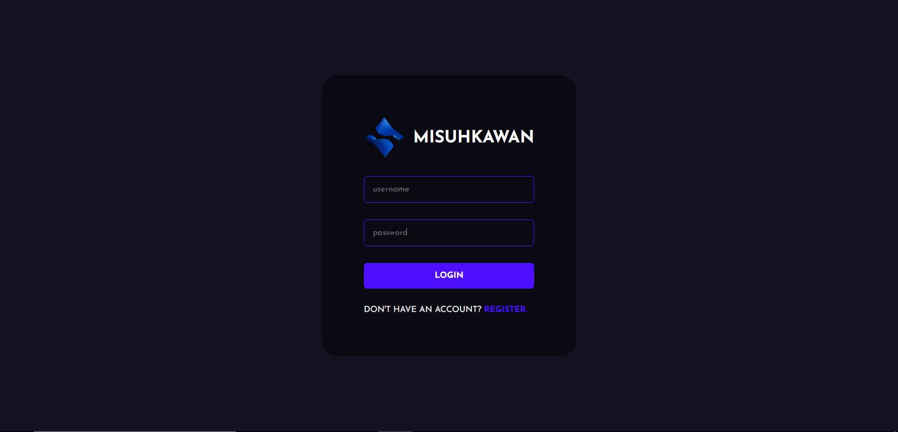
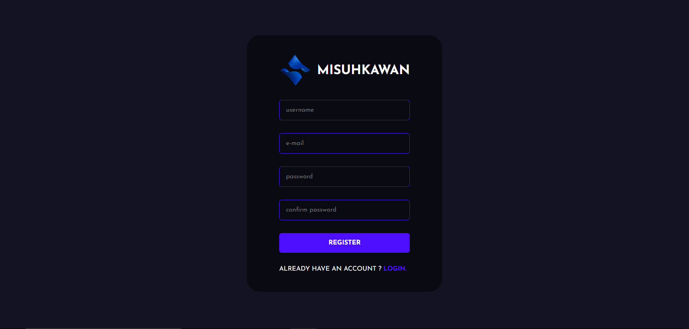
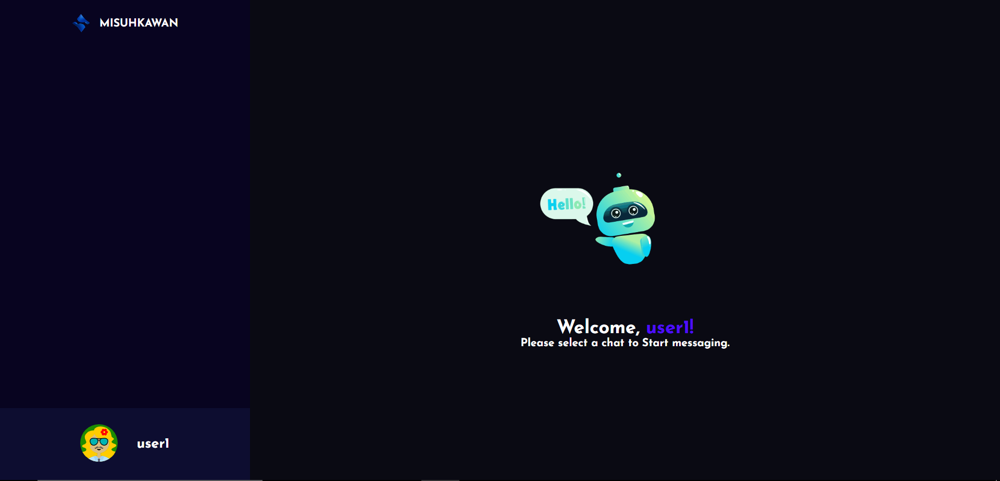

# Chat Application 
This chat application build with the power of MERN Stack. You can find the tutorial [here](https://www.youtube.com/watch?v=otaQKODEUFs)








## Installation Guide

### Requirements
- [Nodejs](https://nodejs.org/en/download)
- [Mongodb](https://www.mongodb.com/docs/manual/administration/install-community/)

Both should be installed and make sure mongodb is running.

```shell
git clone https://github.com/FathurAulia/chat-app-deploy
cd chat-app-deploy
```
Now rename env files from .env.example to .env
```shell
cd public
mv .env.example .env
cd ..
cd server
mv .env.example .env
cd ..
```

Now install the dependencies
```shell
yarn install
```
We are almost done, Now just start the development server.
```shell
yarn dev
```

Done! Now open localhost:3000 in your browser.
